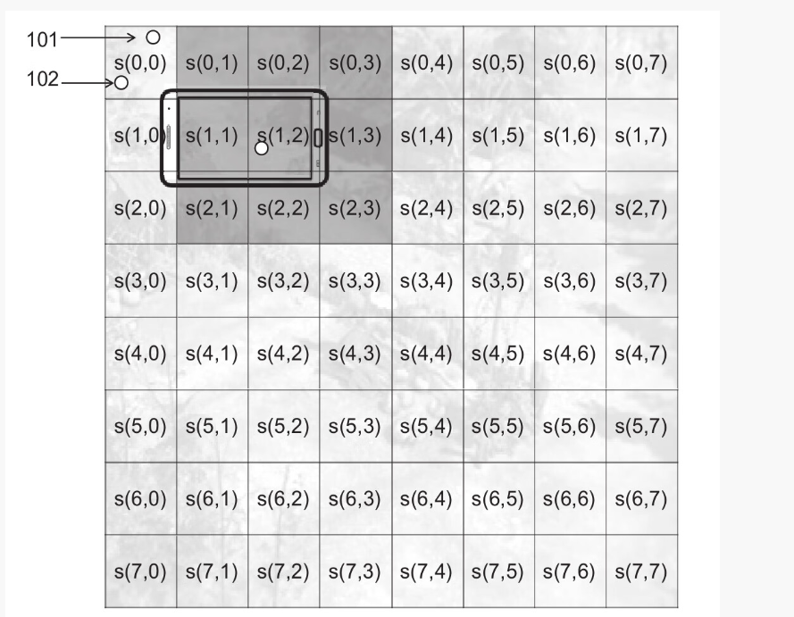

# Chapter8 同步算法

## 同步算法的难点
```
1.浮点数的处理
2.对网络质量要求很高
```

## 代理范例
```js
客户端 可以收集在一段时间(0.1秒内)的所有操作 ,在一次性发送给服务端

客户端协议

 msg:{
    cmd:string;协议名
    turn:number;回合数
    ops:Array<Opt>;//操作
 }


note: turn 表示回合数  服务器会根据 turn 来判断该指令是否是过期


服务端发送给客户端的协议

msg:{
    cmd:string;协议名
    turn:number;回合数
    players:Array<{playerid:string,ops:Array<Opt>}>
}


服务器代码
 myTurn:number=0;//当前轮数
 ops:{[key:number]:{[key:string]:OPS}};
 players:Array<Palyer>=[]玩家列表

 

function msg_client_sync(playerId,msg){
    if(myturn !=msg.turn){// 不是当前轮数丢弃数据
        return;
    }
    const next=myTurn+1;//下一轮
    ops[next]=ops[next] || [];

    if(ops[next][playerId]){ // 已经存入数据不在改变
        return;
    }

    ops[next][playerId]=msg.ops;

}


服务器战斗服保存着当前全部的数据  ,如果客户端断线重连则将客户端断线期间的所有的指令数据给客户端,客户端还原状态


服务器开启一个定时器  收集所有玩家的操作 如果手机了全部玩家的操作 则广播协议
    note:为了配合搜集全部玩家操作 当前客户端没有操作 也要发送空操作协议


// 搜集指令  没隔0.1 s 调用一次on_turn
function on_turn(){
    const next_turn =myTurn+1;// 下一轮
    const next_ops=ops[next_turn];
    const player_count =Object.keys(next_ops||{}).length;

    if(player_count>=players.length){
        myTurn=next_turn;
        smsg=tomsg(next_ops);// 生成消息
        broadcast(smgs);//广播消息
    }
}


note:
     上面代码on_turn 为严格帧同步。 如果客户端执行的很慢 则其他的客户端会等待它


```
### 确定性计算
```
1.浮点数精度
 例如 0.1 m 和 0.3s 

    为了不使用浮点数计算 将0.1 m当成 10cm 0.3s当成 300ms


2.随机数
    为了让服务点和客户端随机计算出同一个数字 因该使用同一个伪随机算法


3.遍历顺序
    保证同一个数字的输入 服务端和客户端 的输出结果一样


4.多线程,异步和协成
    


帧同步的公式

相同的初始状态 + 相同的输入  x 相同的规则  =相同的结果

```

### 乐观帧同步
```
严格帧同步: 客户端快的等待客户端慢的 如果网络环境不好 会造成客户端快的频繁的等待客户端慢的 

乐观帧同步:采取定时不等待策略


乐观帧的定时收集发送
function  on_fiexed_turn(){
    myturn=myturn+1;
    next_op=ops[myturn];
    smsg=tomsg(next_op);
    broadcase(smsg)
}


乐观帧的收集策略


const recv:{[key:string]:Object}={}

function msg_client_sync(playerid,msg){
    const next=myturn+1;
    // 如果消息轮数量已经落后当前轮数5轮以上丢弃消息
    if(msg.turn<(myturn-5)){
        return;
    }

    recv[msg.turn]=recv[msg.turn] || {}

    // 已经接收到当前用户当前轮的数据 
    if(recv[msg.turn][playerid]){
        return;
    }

    recv[msg.turn][playerid]=true;

    const _ops=ops[next][playerid]||[]

    // 将数据合并到点前帧的数据
    ops[next][playerid]= _ops.concat(...msg.ops);

}


乐观帧 牺牲慢玩家的体验为代价保证整体的正常运行

乐观帧 存在轮数的差异 所以每个客户端画面存在差异

乐观帧 可以判断客户端与客户端之间能够存在最大的轮数差异 如果存在直接将客户单踢出去


```

## AOI算法
```

为什么需要AOI算法？
1.大场景游戏  地图上如果有50个玩家  每个玩家每秒钟更新位置5条
   50*50*5=12500 每秒钟服务器同步的数据压力非常大 为了减少压力 使用AOI可以有效的解决问题


角色扮演类游戏(MMORPG) FPS 等游戏  玩家只能与附近的敌人和商贩玩家发生交互战斗 其他地区的玩家根本看不到 所以如果一个玩家 or 什么状态发生变化只需要通知
附近的玩家(附近玩区域 我们称之为感兴趣区域)


实体模型
1.将 角色和 NPC 怪物等 都抽象成实体类 Entity


Entity{
    id:string; 唯一标识
    // 位置信息
    pos:vec2;
    moveto(dst:vec2);将实体移动新的位置

    // 获取感兴趣位置附近的玩家
    get_sight():Array<Entity>;

    // 客户端方法  当一个enitity 进入到 A的感兴趣会触发  on_enter_sight 加载创建对应的UI等模型
    on_enter_sight(id:string);
    // 客户端方法  当一个enitity 离开 A的感兴趣会触发  on_leave_sight 卸载销毁对应的模型UI资源
    on_leave_sight(id:string);
}


get_sight 实现
    1.九宫格算法的实现
        格子大小 客户端一屏能看到的视野大小

    space.ceils:Array<Array<Array<string>>>  每个格子存储Entity id


```


```js
更具上面图片

玩家Role 位于 s(1,2) 格子 

Role 只关心附近的9个格子里面的Entity


通过角色移动需要位置  space.ceils里面对应的数据


角色移动  on_enter  on_leave 进入离开 某个格子 通过格子同步给对应的Entity客户端事  on_enter_sight on_leave_sight


function moveto(dst){
    const ceils=space.ceils;
    // 新坐标所在的格子
    const n_pos=get_ceil_idx(dst);
    // 旧坐标所在的格子
    const o_pos=get_ceil_idx(self.pos);


    // 必须保证格子与格子之间连续
    if(Math.abx(n_pos.x-o_pos.x)>1 || Math.abx(n_pos.y-o_pos.y)>1 ){
        return;
    }

    // 同步位置 移动

    self.pos.x=dst.x;
    self.pos.y=dst.y;


    // 情况1 在原来的格子里面

    if(n_pos.equal(o_pos)){ // 不做任何处理

    }else if(n_pos.x==(o_pos.x+1)&& n_pos.y==o_pos.y){// 向右走

        // 左边一列离开
        on_leave(self.id,ceils[o_pos.x-1][o_pos.y-1])
        on_leave(self.id,ceils[o_pos.x-1][o_pos.y])
        on_leave(self.id,ceils[o_pos.x-1][o_pos.y+1])

        // 将格子里面的id 删除
        remove(self.id,ceils[o_pos.x][o_pos.y]);
    
        // 最右边一列的监听到进入
        on_enter(self.id,ceils[o_pos.x+2][o_pos.y-1])
        on_enter(self.id,ceils[o_pos.x+2][o_pos.y])
        on_enter(self.id,ceils[o_pos.x+2][o_pos.y+1])

        // 进入到新格子
        add(self.id,ceils[n_pos.x][n_pos.y])
    }
    .......

}


AOI 不仅能减少数据发送还能减少碰撞检测

```